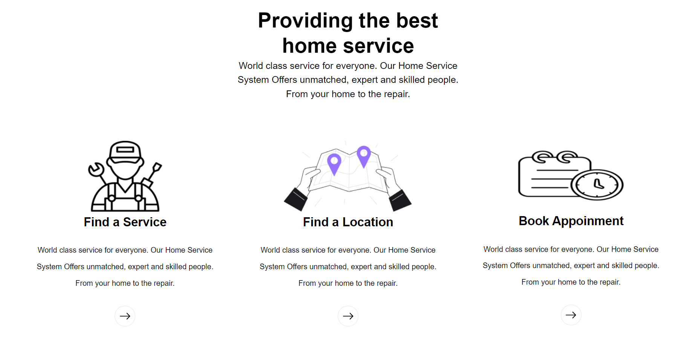

# FixIt - Smart Utility Management System

FixIt is a smart utility management system designed to streamline the process of booking plumbers and electricians in a society. With a focus on enhancing service quality and customer satisfaction, FixIt provides an intuitive platform for users to schedule, rate, and manage service requests efficiently.

## Technologies Used
- **Frontend**:
  - ReactJS
  - JavaScript
  - CSS
  - Bootstrap
- **Backend**:
  - Node.js
  - Express.js
  - REST API
- **Database**:
  - MongoDB

## Features
### 1. **Service Request Management**
   - Users can effortlessly book plumbers and electricians for their required tasks.
   - A seamless interface to raise and track service requests.

### 2. **Real-Time Updates**
   - Provides real-time updates on the status of service bookings, ensuring transparency and convenience.

### 3. **Rating and Feedback Mechanisms**
   - Integrated rating and feedback features allow users to evaluate service providers, fostering better service quality.

### 4. **Scheduling Services**
   - Allows users to schedule services at their preferred time, improving flexibility and convenience.

### 5. **Streamlined Backend**
   - Built a robust backend system to manage service requests, bookings, and updates efficiently.

## Usage
1. Log in to your account or sign up as a new user.
2. Book a service by selecting the required category (Plumber/Electrician) and providing necessary details.
3. View real-time updates on your booking status.
4. After the service is completed, provide ratings and feedback to improve overall service quality.
